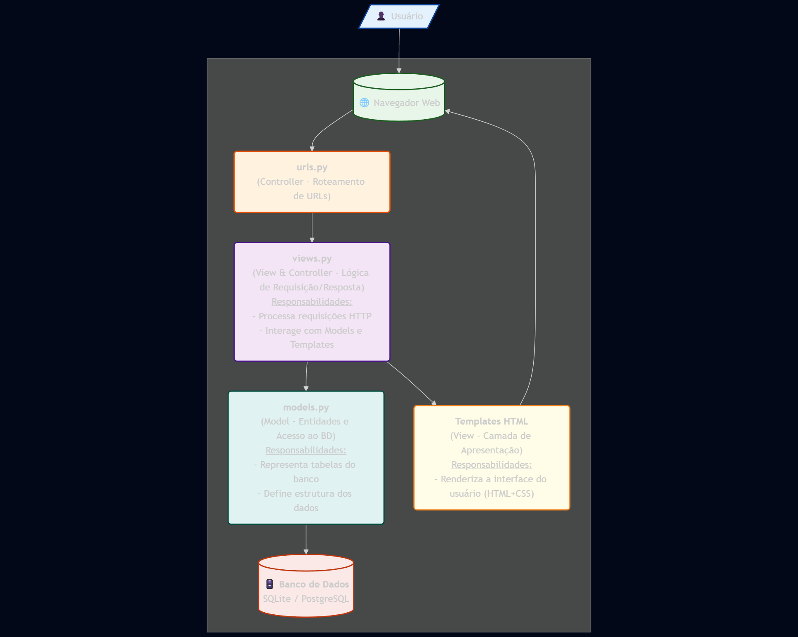

# Arquitetura do Sistema – Cuidando do Meu Bairro 3.0

Este documento descreve a arquitetura atual da aplicação, com o objetivo de servir como guia técnico para desenvolvedores que desejam contribuir ou realizar manutenção evolutiva no sistema.

---

## 📌 Visão Geral

A aplicação **Cuidando do Meu Bairro 3.0** é uma plataforma web construída com o framework **Django** (Python), adotando o padrão arquitetural **MVC** (Model-View-Controller) com estrutura monolítica.

---

## 🧱 Estrutura Arquitetural

### 🗂️ Organização em Camadas (MVC)

- **Model**: Representa as entidades e tabelas do banco de dados.  

- **View**: Contém a lógica que responde às requisições HTTP.  

- **Controller (URLs + Views)**:  
  *O roteamento é definido em:* `cuidando/urls.py`, que conecta URLs às views responsáveis.

---

## 🔄 Fluxo de Requisição

Usuário → Navegador → URLs (urls.py) → Views (views.py) → Models (models.py) → Banco de Dados

---

## 🛠️ Tecnologias Utilizadas

- Python 3.x  
- Django 4.x  
- SQLite / PostgreSQL (dependendo do ambiente)  
- HTML + CSS (via Django Templates)  
- Bibliotecas de apoio: `requests`, `django.contrib`, entre outras

---

## 🔐 Autenticação

- Sistema de autenticação nativo do Django (`django.contrib.auth`)  
- Sessões e autenticação baseadas em cookies

---

## 📊 Funcionalidades Principais

- **Mapa de Gastos Públicos**: Interface interativa com dados orçamentários  
- **Consulta de Despesas**: Exibição de tabelas com filtros  

---

## ⚠️ Considerações Importantes

- **Estrutura monolítica**: Todo o sistema reside em um único projeto Django, o que facilita a manutenção inicial, mas exige boas práticas para escalar.
- **Boas práticas recomendadas**:
  - Manter responsabilidades separadas por app (caso queira modularizar no futuro)
  - Escrever testes com `pytest` ou `unittest`

---

## 🧪 Testes

- O projeto faz uso de uma esteira de testes automatizados, onde os detalhes se encontram na documentação de testes

---

## Diagrama Arquitetura de Software

